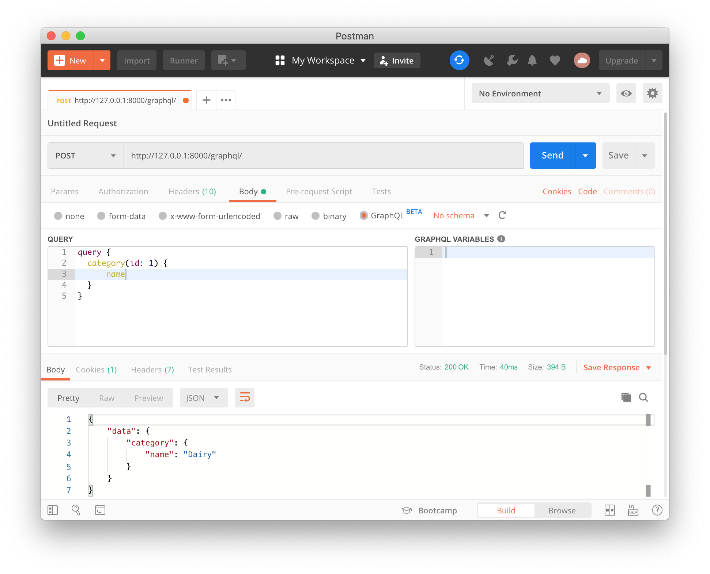
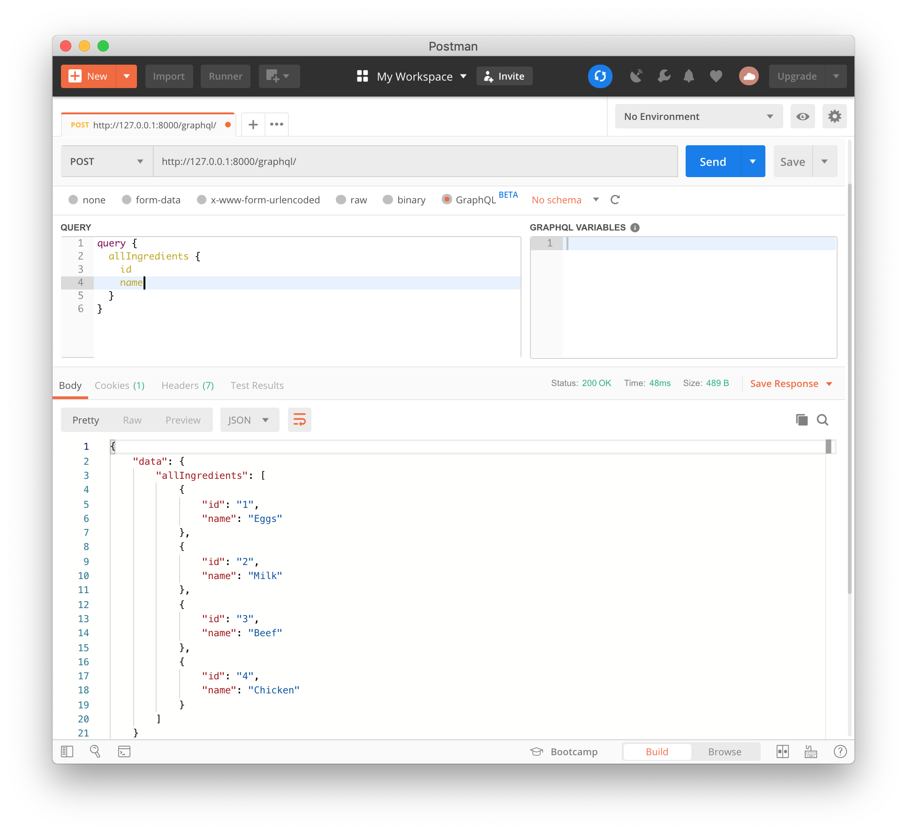

# Graphene-Django 튜토리얼
Python으로 GraphQL을 구현하기 위해 Django와 Graphene 라이브러리 그리고 graphene-django 플러그인을 이용한 튜토리얼

## 설치 가이드
(1) 파이썬 패키지 설치하기
```bash
$ pip install -r requirements.txt
```
Pipenv를 사용 한다면..
```bash
$ pipenv install
```

(2) 장고 마이그레이션
```bash
$ cd cookbook;
$ python manage.py migrate
```

(3) 샘플 데이터 불러오기
```bash
$ python manage.py loaddata ingredients
```

(4) 장고 서버 실행
```bash
$ python manage.py runserver
```

## GraphQL 쿼리 호출하기



